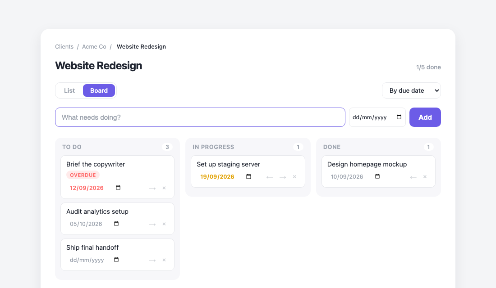
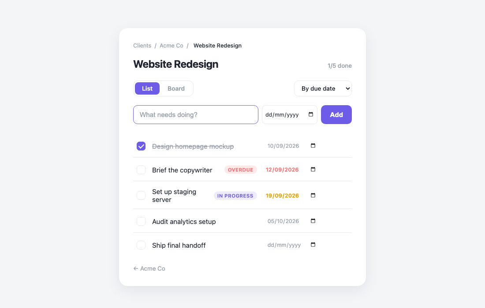

# StudioBoard

[](https://github.com/Dips9890/studioboard/actions/workflows/tests.yml)
[](https://www.python.org/)
[](LICENSE)

A lightweight project manager for freelancers and agency founders. Work is organised the way client
services actually runs — **client → project → task** — and every project can be viewed either as a
checklist or as a kanban board.



## Features

- **Client / project / task hierarchy** with breadcrumb navigation at every level
- **Two views per project** — a checklist for quick triage, a kanban board for seeing work in flight
- **Three task states** — To do, In progress, Done — with one-click moves between board columns
- **Due dates** — set inline on any task, with overdue shown in red and due-today in amber.
  Completed tasks are never flagged as late
- **Sorting** by manual order, alphabetically, by status, or by due date (undated tasks last)
- **Shareable view state** — the active view and sort live in the URL, so any board is bookmarkable
  and the browser back button behaves correctly
- **Progress at a glance** — completed/total counts on every project and column
- **Light and dark themes**, following the operating system preference
- **Automatic schema migration** — data written by earlier versions is upgraded on load

### List view



## Tech stack

| Layer | Choice | Why |
| --- | --- | --- |
| Backend | Python 3.9+, Flask 3 | Small enough to read in one sitting, no hidden magic |
| Templating | Jinja2 with template inheritance | Server-rendered HTML, no client-side framework needed |
| Styling | Hand-written CSS with custom properties | No build step; theming is a variable swap |
| Persistence | JSON file | Zero setup for a single-user local tool (see *Design notes*) |
| Tests | pytest + Flask test client | Routes and domain logic covered without a browser |

## Getting started

```bash
git clone https://github.com/Dips9890/studioboard.git
cd studioboard
python3 -m venv venv
source venv/bin/activate        # Windows: venv\Scripts\activate
pip install -r requirements.txt
python app.py
```

Then open <http://127.0.0.1:5050>. Your data is written to `data.json` in the project root, which is
created on first run and is not tracked by git.

### Configuration

| Environment variable | Default | Purpose |
| --- | --- | --- |
| `PORT` | `5050` | Port the development server binds to |
| `FLASK_DEBUG` | off | Set to `1` to enable auto-reload and the debugger |
| `STUDIOBOARD_DATA` | `./data.json` | Path to the data file (used to isolate test runs) |

## Running the tests

```bash
pip install -r requirements-dev.txt
pytest
```

The suite covers the HTTP routes end to end (via Flask's test client), the sorting and progress
helpers, input validation, and the legacy-data migration path. Each test runs against a temporary
data file, so it never touches real data.

## Project structure

```
studioboard/
├── app.py                 # Flask routes and request handling
├── storage.py             # Persistence, migrations, and domain helpers
├── templates/
│   ├── base.html          # Shared layout, extended by every page
│   ├── clients.html       # Client index
│   ├── client.html        # Projects belonging to one client
│   └── project.html       # Task list and kanban board
├── static/style.css       # Design tokens and all styling
├── tests/                 # pytest suite
└── docs/                  # README screenshots
```

## Design notes

**Why a JSON file instead of a database.** StudioBoard is a single-user local tool, so a file keeps
setup at zero — clone and run, no migrations or server to manage. Persistence is isolated behind
`storage.py`, so moving to SQLite means rewriting one module rather than touching every route.

**Why view state lives in the URL.** Putting `?view=board&sort=alpha` in the query string rather
than in a session or in local storage makes every view linkable, keeps the back button working, and
means the server can render the correct page with no client-side state to synchronise. Incoming
values are validated against an allowlist, so a hand-edited URL can't break the page.

**Schema migrations.** Tasks originally stored a boolean `done`. Adding a kanban board required a
three-state `status`, and due dates later added an optional `due` field, so `storage._migrate`
upgrades old records on load. It is idempotent and runs on every read, which means existing data
survives each change without a separate migration step.

**Dates are stored as ISO strings.** `YYYY-MM-DD` sorts correctly as plain text, needs no timezone
handling for what is a calendar date rather than a moment in time, and is what `<input type="date">`
submits natively — so no date library is needed anywhere in the stack.

**Always-visible card controls.** The move and delete controls on board cards were initially
revealed on hover. They are now always visible at reduced opacity, because hover-only affordances
are invisible on touch devices — and on a kanban board, moving a card is the primary action.

### Known tradeoffs

These are deliberate scope decisions for a local single-user tool, not oversights:

- **No authentication** — the app assumes a single trusted user on `localhost`
- **IDs are `max(id) + 1` per collection**, so an ID can be reused after the newest record is
  deleted. Harmless for one user; a persistent counter or UUIDs would be needed for concurrent use
- **Writes are last-write-wins** — the whole file is rewritten per change, with no file locking
- **The bundled server is Flask's development server** and is not hardened for public deployment; a
  production deploy would need a WSGI server such as Gunicorn behind a reverse proxy

## Roadmap

- [x] Due dates, with overdue highlighting
- [ ] Calendar / timeline view built on due dates
- [ ] Drag-and-drop between board columns
- [ ] Time tracking per task for hourly billing
- [ ] Cross-client dashboard of everything due this week
- [ ] SQLite persistence behind the existing storage interface

## License

Released under the [MIT License](LICENSE).
